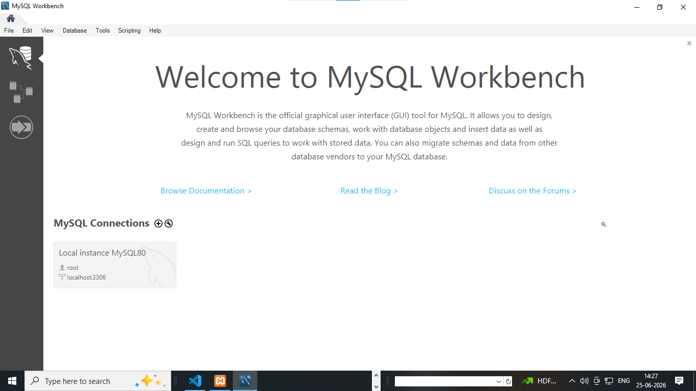

# what is SQL ?

1. SQL stands for structure query language 
2. SQL will used to create database and tables structures
3. SQL will be a case insenstive language
examples : insert | INSERT | Insert
4. SQL create database and  table structured using SQL query or commands
5. SQL is an structured based language 

# what is Database or MYSQL ?

1. database is used to stored an information 
2. MySQL is and database 
3. MySQL database create an GUI (graphical user interface) where we create database and provides relations.
4. MySQL provides two interface 

1. xampp 


2. mySQLworkbench8.0




# advantage of SQL ? 

1. create database structured 
2. create tables structured 
3. create a structured data in form of tables 
4. create case insenstive language 
5. create relationship between one tables to another 
6. create some query or commands

# SQL query or commands 

1. DDL (data definition language) 
2. DML (data manipulation language)
3. DQL (data Query language) 
4. TCL (transactional control language)


# what is  DDL  ? 

1. DDL stands for data definition language 
2. create database and table structured 

# DDL query list ?

1) create database
2) create table
3) alter 
4) truncate 
5) drop 
6) rename
7) change 

1) how to create database 

**syntax**

```
create database databasename;
or
create database data_science_app;

``` 


# SQL data types ............ 

## Numeric Data Types

| Data Type | Size | Description |
|-----------|------|-------------|
| `TINYINT` | 1 Byte | Stores very small whole numbers (-128 to 127 or 0 to 255). |
| `SMALLINT` | 2 Bytes | Stores small whole numbers. |
| `INT` / `INTEGER` | 4 Bytes | Stores standard whole numbers. |
| `BIGINT` | 8 Bytes | Stores very large whole numbers. |
| `DECIMAL(p,s)` | 5–17 Bytes* | Stores exact decimal values with specified precision and scale. |
| `FLOAT` | 4 Bytes | Stores approximate single-precision floating-point numbers. |
| `DOUBLE` | 8 Bytes | Stores approximate double-precision floating-point numbers. |


## Character/String Data Types

| Data Type | Size | Description |
|-----------|------|-------------|
| `CHAR(n)` | Fixed (`n` Bytes) | Stores fixed-length character strings. |
| `VARCHAR(n)` | Variable (up to `n` Bytes + 1–2 Bytes overhead) | Stores variable-length character strings. |
| `TEXT` | Up to 65,535 Bytes | Stores large amounts of text. |


## Date and Time Data Types

| Data Type | Size | Description |
|-----------|------|-------------|
| `DATE` | 3 Bytes | Stores a date (`YYYY-MM-DD`). |
| `TIME` | 3 Bytes | Stores a time (`HH:MM:SS`). |
| `DATETIME` | 8 Bytes | Stores both date and time. |
| `TIMESTAMP` | 4–8 Bytes | Stores date and time, often with automatic timestamp updates. |


## Boolean Data Type

| Data Type | Size | Description |
|-----------|------|-------------|
| `BOOLEAN` | 1 Byte | Stores `TRUE` or `FALSE` values. |


## Enumerated Data Types

| Data Type | Size | Description |
|-----------|------|-------------|
| `ENUM` | Fixed (`n` Bytes) | Stores fixed-length binary data with multiple choices data. |


1) how to create table 

**syntax**

```
create table tablename
(
columnname datatype size primary key auto_increment,
columnname datatype(size),
.
.
.
.
columnname datatype(size)

)

```

**examples**

```
create table tbl_users
(
uid int AUTO_INCREMENT primary key,
name varchar(255),
email varchar(255),
phone bigint,
address text

)


``` 

**examples**

``` 
create table tbl_appointment
(
apid int AUTO_INCREMENT primary key,
patientname varchar(255),
age int,
phone bigint,    
appointment_date_time timestamp,
desease ENUM('eyes problems','teeth problems','ear problems')    

)


```  


**examples**
```

create table tbl_employee
(
empid int AUTO_INCREMENT primary key,
name varchar(255),
age int,
phone bigint,    
salary float,
attendance boolean,
added_date_time datetime
)

```
**examples**

```
create table tbl_feedback
(
feedbackid int AUTO_INCREMENT primary key,
name varchar(255),
email varchar(255),
subject varchar(255),
phone bigint,
rating varchar(255),
comment text   

)

```

# create a tables with columnname 

**categories**

1. catid 
2. categoryname

**subcategories**

1. subcatid
2. subcategoryname

**products**

1. pid
2. pname
3. pimage
4. qty
5. price
6. descriptions
7. added_date


# alter : 

1. after create table we can add some column name in table there alter 

``` 
alter table tbl_users add country varchar(255);
or
alter table tbl_users add state varchar(255);
```

2. after any columnname add a column 

```
alter table tbl_users add photo varchar(255) after email;
```   


3. alter is also used to change the column name or update column name 

```
alter table tbl_users change country countryname varchar(255)
or
alter table tbl_users change state statename varchar(255)

```

4. alter will also drop the columnname 

```

alter table tbl_employee drop added_date_time;

```   

5. alter create a unique columns 

```
alter table tbl_employee add unique(`email`);
```   


# how to rename a table name after create any tables 

```
rename table tbl_appointment to appointment;
or
rename table tbl_employee to employee;
or
rename table tbl_users to users;
```


# drop :  drop is used to delete database or table or any columnname of table 

1. how to drop database

```
drop database databasename
or
drop database data_science_app;
```


2. how to drop table

```
drop table tablename
or
drop table appointment;
```

3. how to drop a columnname of tables 

```
alter table tbl_employee drop added_date_time;

```  


# truncate :  truncate is used to delete all data from tables after truncate data never rollback

```

truncate table tablename;
or
truncate table tbl_employee

```

# what is DML (data manipulate language) ?

1. DML stands for data manipulation language 
2. it is used to manipulate data after creating tables 
3. DML handel insert | delete and update data 

## DML query are 

1. insert
- insert a single or multiple rows in tables 
- how to add or insert single data 
- examples 
```
insert into tablename(columnname) values('value');
or 
insert into tbl_categories(categoryname) value('electronics')
or
insert into tbl_employee(name,upload_photo,age,phone,salary,attendance,status,email) value('meet','meet.jpg',21,912221545,15500,1,'pending','meet@gmail.com');
```   

- how to add multiple data
- examples ......

```
insert into tbl_employee(name,upload_photo,age,phone,salary,attendance,status,email) values('brijesh','brijesh.jpg',31,912821545,155000,1,'pending','brijesh@gmail.com'),('pranav','pranav.jpg',31,982221545,17500,1,'pending','pranav@gmail.com');

or


insert into tbl_employee values(null,'forum','forum.jpg',21,652821545,14000,1,'pending','forum@gmail.com'),(null,'astha','astha.jpg',21,982221545,17500,1,'pending','astha@gmail.com');

```
2. delete 
 - delete is used to delete data 
 - delete are used to delete all data from tables 
 - delete are used to delete particular data using where clause
 - delete are used to delete range of  data from tables
 - delete are used to delete alternate of data from tables     

## query are ....

 ```
 delete from tbl_employee   (delete all rows from tables)
 delete from tbl_employee where empid=1 (delete particular 1 data from table)
 delete from tbl_employee where empid in (1,3,5,7);  (alternate delete)
 delete from tbl_employee where empid between 500 and 1000; (range of data delete)

 ``` 
# note : after delete rows of data from tables we cam rollback data 

  
3. update :

   - update is used to update rows or data from tables 
   - update is used to update particulars data from tables using where clause
   - examples are ....

   ```
   update tbl_employee set name='kumar',upload_photo='kumar.png',age=33,phone=634545845,salary=18500,attendance=0,status='completed',email='kumar007@gmail.com' where empid=4;
   ```


# what is DQL (data query language) ?

  - DQL stands for data query language 
  - DQL is used to select data or fetch data  
  - DQL query are ...

    1. select  (select all data)
       
       ```
       select * from tbl_employee
       ```

    2. select  (select particular 1 data)
       
       ```
       select * from tbl_employee where empid=4
       ```

   
    3. select  (select particular range of data)
       
       ```
       select * from tbl_employee where empid between 1 and 5;
       ```    
    
    4. select  (select particular alternate of data)
       
       ```
       select * from tbl_employee where empid in (1, 2, 4, 7);
       ```    

    5. select  (select particular columnname of data)
       
       ```
       select empid,name,salary from tbl_employee;
       ```    

    
    6. select  (select particular with name of data)
       
       ```
       select * from tbl_employee where name='kumar';
       ```    
    
    7. select  (select name is ascending order or descending order)
       
       # order by  : filter in asc and desc order
       ```
       select * from tbl_employee  order by name asc;
       or
       select * from tbl_employee  order by name;
       or
       select * from tbl_employee  order by name desc;
       ```    

# TCL : stands for transanctional control language

  - TCL is used to rollback data from table
  - TCL is also used to commit data from table 
  - TCL query are .....

    1. commit
    2. rollback  

## commit ....

   - commit is used to start transaction and commit(save) data before delete
   - commit is always used before delete data from tables 
   - how to commit data before delete 
   # commit .....
   ```
    START TRANSACTION;
    delete from tbl_employee where empid=7;
    COMMIT; 
   ```  


# rollback : 

  - rollback start transaction and rollback data 
  - rollback are used to rollback data in tables after delete 
  - rollback query are ...

  ## rollback ...

    ```
    START TRANSACTION;
    delete from tbl_employee
    WHERE empid=7;
    SELECT * FROM tbl_employee WHERE empid=7;
    ROLLBACK;
    SELECT * FROM tbl_employee WHERE empid = 7;

    ``` 

# Note : some database structures not support rollback and commit   

# key constraints :  

  - key constraints provides limit on tables 
  - key constraints used to provides normalized tables 
  - key constraints are used to provides relationship between tables 

  ## types of key constraints

  1. primary key 
  2. unique key 
  3. foreign key  

   
    
